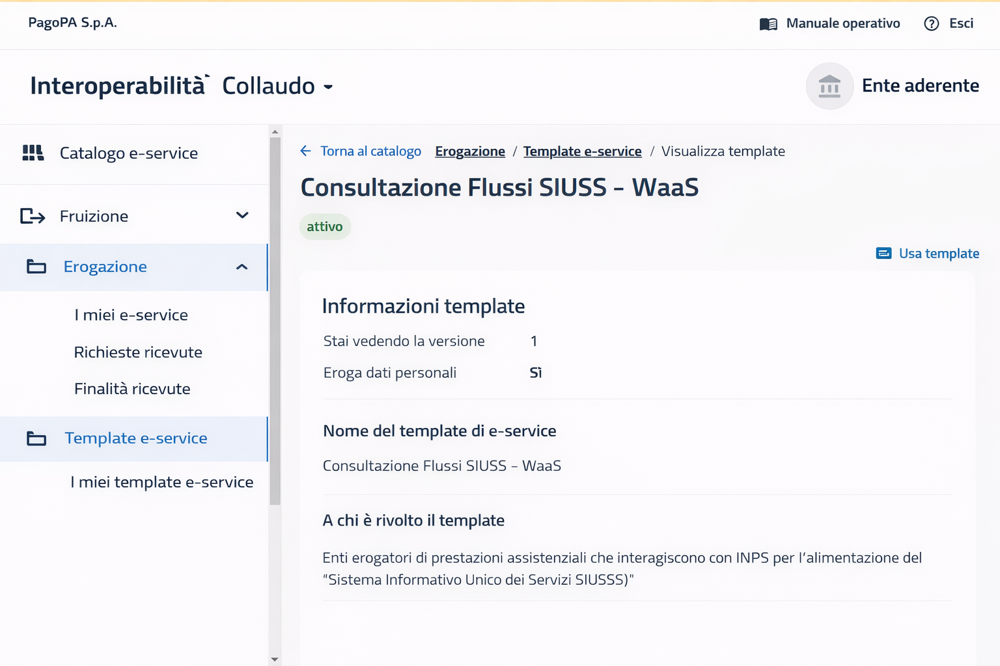
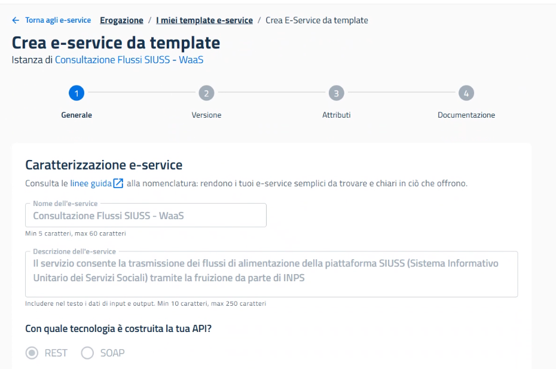
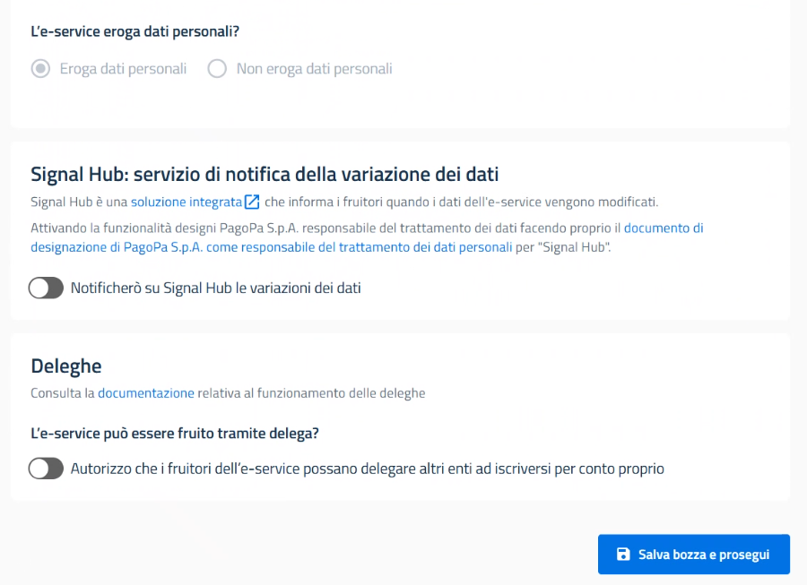
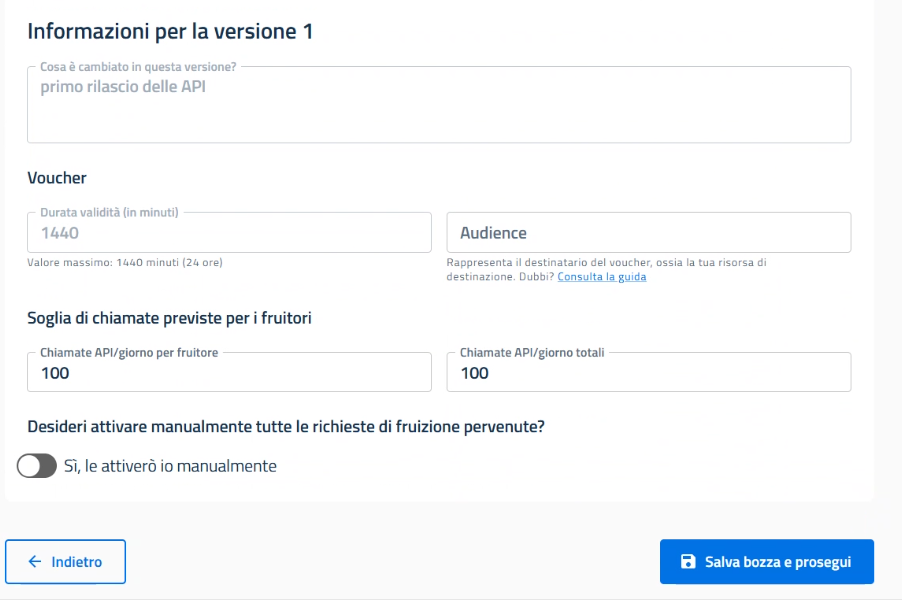
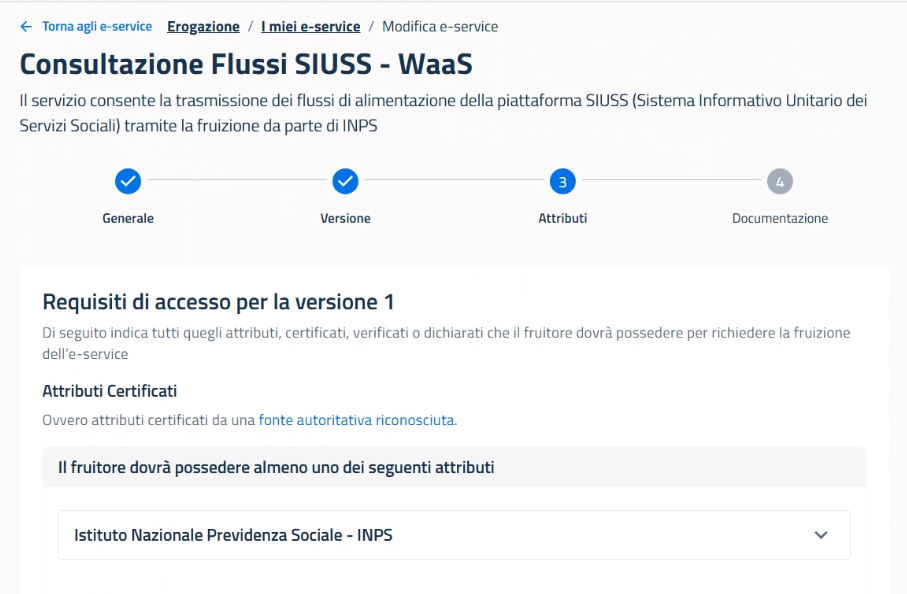
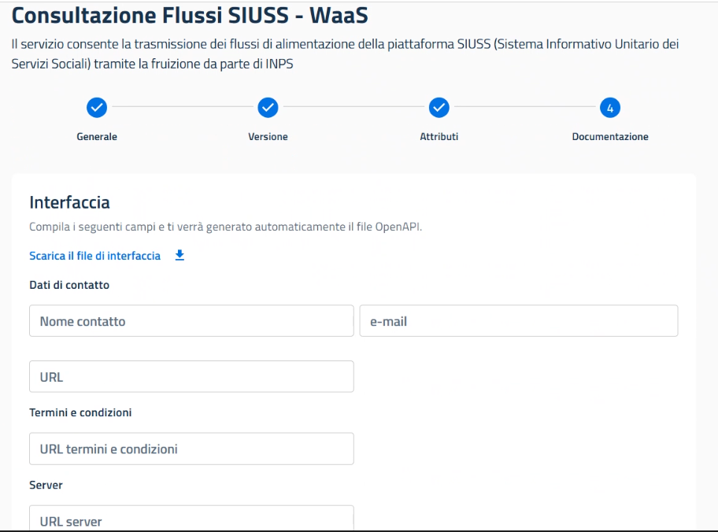

# Guida per i Comuni  
## Welfare as a Service (WaaS) - Servizio di Alimentazione SIUSS 

Questo documento contiene le indicazioni operative per l’esposizione delle API WaaS di popolamento del **SIUSS – Sistema Informativo Unitario dei Servizi Sociali** da parte degli Enti partecipanti al progetto **Welfare as a Service (WaaS)**.

## 1. Contesto

Il servizio di Alimentazione SIUSS consente ai Comuni di trasmettere a INPS i flussi informativi necessari all’alimentazione del sistema SIUSS, secondo le specifiche tecniche e di interoperabilità definite.

A partire dal 2025, INPS ha introdotto un **template eService PDND** per standardizzare la pubblicazione del servizio di Alimentazione SIUSS da parte degli Enti aderenti.

Il template di riferimento è denominato: **Consultazione Flussi SIUSS – WaaS**.

Il template è attualmente disponibile in **ambiente di collaudo** e in **ambiente di produzione** e rappresenta il modello di riferimento per le **nuove adesioni**, a partire dalla sua pubblicazione.

## 2. Modalità di adesione

Sono previste due modalità:

- **Nuove adesioni**  
  Possono avvenire tramite il template eService PDND predisposto da INPS.

- **Enti già aderenti**  
  Gli Enti che hanno già pubblicato autonomamente l’eService prima dell’introduzione del template possono continuare a utilizzare le erogazioni già attive. Il passaggio al template potrà essere richiesto in occasione di eventuali aggiornamenti del servizio che introducano modifiche non retrocompatibili.

## 3. Implementazione dell’API di alimentazione

Il Comune deve implementare l’API di alimentazione in accordo alle specifiche OpenAPI disponibili nel repository:

- https://github.com/INPS-it/WaaS.Comuni/blob/main/002%20-%20OpenAPI/api-comuni.yaml

## 4. Adesione alla piattaforma PDND

Se non già effettuata, l’adesione alla piattaforma PDND deve essere completata secondo la guida ufficiale PagoPA:

- https://docs.pagopa.it/interoperabilita-1/manuale-operativo/guida-alladesione

È necessario verificare che gli indirizzi e-mail istituzionali dell’Ente siano correttamente configurati,
poiché verranno utilizzati per tutte le comunicazioni formali.

## 5. Pubblicazione e configurazione dell’eService tramite Template

### Accesso al template

1. Accedere al **Portale PDND**.
2. Individuare il template **“Consultazione Flussi SIUSS – WaaS”** nella sezione **Erogazione → Template e-service** e accedere al relativo dettaglio.

3. Derivare una nuova istanza del servizio cliccando su **“Usa template”**.

### Step 1 – Signal Hub e Deleghe

Nel contesto dello step 1 mantenere **non attive** le opzioni relative a:

- Signal Hub
- Deleghe

### Step 2 – Configurazioni di sicurezza e carico

#### Impostazione dell’audience PDND
Impostare il valore dell’audience per la validazione dei token.

#### Soglie di carico (Rate limits)
Il template propone valori predefiniti. L’Ente può:

- accettare i valori consigliati;
- definire soglie personalizzate.

#### Accettazione delle richieste di fruizione
Poiché la fruizione è consentita al solo ente **INPS**, si sconsiglia l’attivazione della modalità di accettazione manuale.

### Step 3 – Attributi vincolati

Non è possibile modificare gli attributi che prevedono il vincolo di fruizione al solo ente INPS.

### Step 4 – Completamento del descrittore API

L’Ente deve completare:

- dati di contatto tecnici;
- URL dei Termini del Servizio;
- URL dei server che espongono l’API.

## 6. Invio della richiesta di adesione a INPS

Dopo la pubblicazione dell’eService, il Comune deve inviare una comunicazione a:

📧 **progettowelfareasaservice@inps.it**

indicando:

- nome dell’Ente;
- codice Belfiore;
- IP o range di IP di erogazione (collaudo e produzione).

## 7. Fruizione del servizio

### Collaudo
INPS inoltrerà la richiesta di fruizione in collaudo ed effettuerà le verifiche tecniche.

### Produzione
A seguito del buon esito del collaudo, il servizio sarà attivato in Produzione.

## 8. Documentazione tecnica

Il repository contiene:

- schemi `.xsd` dei flussi SIUSS;
- OpenAPI `.yaml`.

## 9. LINK UTILI

-   [Manuale PDND](https://docs.pagopa.it/interoperabilita-1)
    Interoperabilità

-   [Repository Github
    WaaS.Comuni](https://github.com/INPS-it/WaaS.Comuni)
