WaaS - Welfare as a Service

# Guida all'erogazione di e-service per WaaS
V1.1 - Marzo 2024

Il progetto “Welfare as a Service” (WaaS) ha l’obiettivo di realizzare la condivisione e l’interoperabilità delle banche dati a livello centrale e locale tra INPS, gli Enti locali e le altre amministrazioni centrali della comunità digitale del welfare. Componente centrale del progetto è il Sistema Informativo Unico dei Servizi Sociali (SIUSS), una banca dati integrata di tutte le informazioni relative alle prestazioni sociali presenti sul territorio. La banca dati viene tenuta regolarmente aggiornata da INPS, utilizzando una API di interscambio esposta da tutti i soggetti interessati tramite la Piattaforma Nazionale Digitale dei Dati (PDND).

# INDICE DEI CONTENUTI

-   [INTRODUZIONE](#introduzione)

-   [REPOSITORY GITHUB](#repository-github)

-   [GUIDA ALLA PUBBLICAZIONE SU
    PDND](#guida-alla-pubblicazione-su-pdnd)

-   [LINK UTILI](#link-utili)

# INTRODUZIONE

Il
[SIUSS](https://www.inps.it/it/it/dati-e-bilanci/siuss--ex-casellario-dell-assistenza.html)
(Sistema Informativo Unico dei Servizi Sociali) deve essere alimentato
da ciascun ente con le proprie informazioni ai sensi del Decreto
206/2014. L'alimentazione può avvenire sia contattando un e-service
pubblicato da INPS, sia pubblicando un e-service che verrà contattato
periodicamente da INPS.

Il seguente documento supporta i Comuni nella pubblicazione
dell'e-service per il popolamento del SIUSS sulla Piattaforma digitale
Nazionale Dati (PDND), guidando passo a passo nella preparazione ed
erogazione. L'e-service pubblicato può essere parte degli adempimenti
necessari per l'asseverazione dei progetti finanziati con gli avvisi
legati alla Misura 1.3.1 del PNRR per i Comuni

Per maggiori informazioni sull'adesione e l'utilizzo della Piattaforma,
riportiamo tra i [link utili](#link-utili) a fine documento il
collegamento al manuale di [PDND
Interoperabilità](https://docs.pagopa.it/interoperabilita-1).

# REPOSITORY GITHUB

Il repository Github **WaaS.Comuni** pubblicato da INPS
(<https://github.com/INPS-it/WaaS.Comuni>) contiene le specifiche
tecniche per le API di popolamento del SIUSS da parte dei Comuni.

Invitiamo in particolare a visionare:

-   il **README** introduttivo

-   la cartella **OpenAPI** contenente la specifica, in formato openapi
    3.0.3 del servizio da implementare.

-   la cartella **Specifiche Tecniche** contenente i documenti con le
    specificha tecnica del servizio e la logica con cui INPS utilizzerà
    la API per l'alimentazione della banca dati del progetto.

## GUIDA ALLA PUBBLICAZIONE SU PDND

### 1. Selezione dell'ambiente

PDND Interoperabilità mette a disposizione dei suoi aderenti due
ambienti, collaudo e produzione. L'ambiente di collaudo, denomitato
"*Interoperabilità collaudo*", è stato creato con lo scopo di effettuare
dei test sull'integrazione tra aderenti, oppure per verificare la
propria integrazione con PDND. L'ambiente di produzione, denominato
"*Interoperabilità*", è l'ambiente dove vengono erogate le API
effettivamente utilizzate dagli altri aderenti della piattaforma. In
PDND non c'è bisogno, da parte dell'aderente, di fare alcuna
operazione aggiuntiva a valle dell'adesione, i due ambienti saranno
attivati automaticamente.

Per selezionare l'ambiente dove si intende operare seguire i seguenti
passi:

1.  Effettuare il login con le credenziali SPID o CIE
2.  Selezionare l'ente per il quale sto operando
3.  Selezionare il prodotto "*Interoperabilità*"
4.  Successivamente alla selezione del prodotto, comparirà una schermata
    dove viene chiesto se si intende operare sull'ambiente di collaudo
    o produzione
5.  Selezionare l'ambiente desiderato

Gli ambienti di collaudo vanno sempre mantenuti attivi, per permettere
sia all'ente, che ai fruitori, di effettuare test sull'API, prima di
operare su quella di produzione.

*NB: Tutti i passaggi mostrati nella guida devono essere ripetuti sia in
ambiente di collaudo che in ambiente di produzione.*

### 2. Inserimento contatti

*NB: La modifica dei contatti è possibile per i soli utenti che
possiedono il ruolo di amministrazione della piattaforma.*

1.  Una volta scelto l'ambiente in cui intendi operare, dal menu di
    sinistra seleziona **il tuo ente** \> **anagrafica e attributi.**
    Successivamente clicca su **modifica** nella sezione
    contatti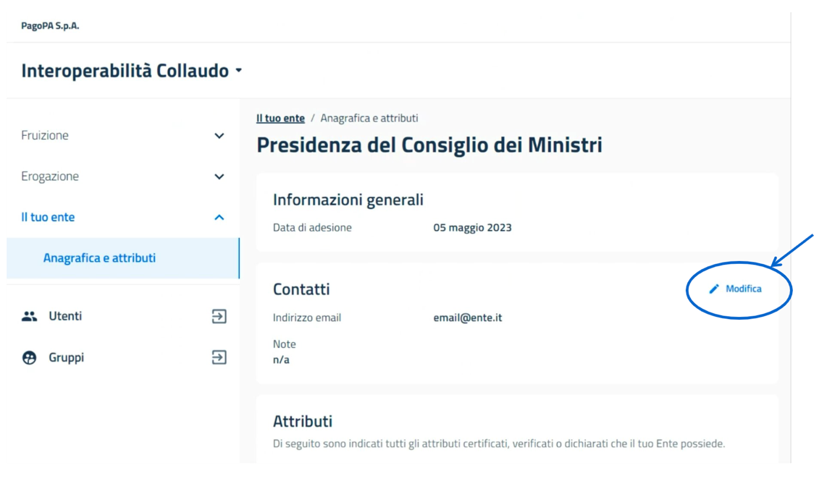

2.  inserisci una mail di contatto diretto dell'utente che gestisce la
    piattaforma per conto del comune.

     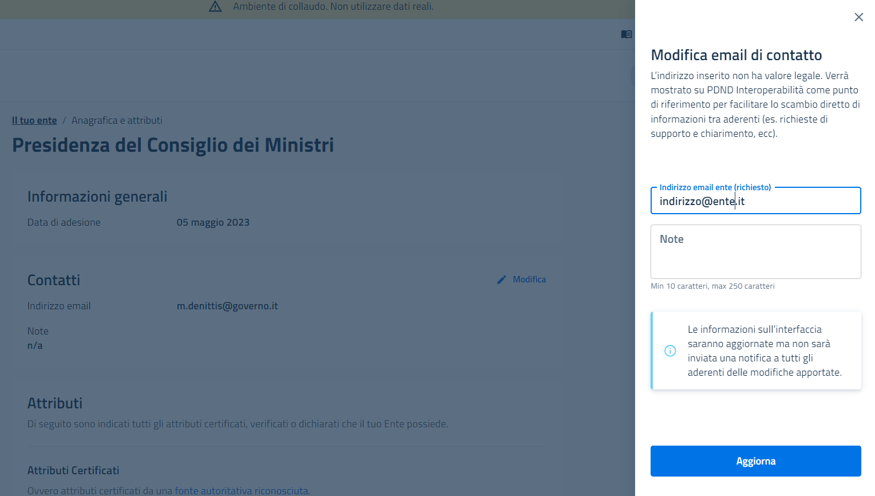

     NB: L'indirizzo potrà essere utilizzato da INPS e da altri enti per
     comunicazioni di carattere tecnico: si suggerisce di inserire un
     contatto diretto dell'utente amministratore della piattaforma,
     evitando di inserire PEC o indirizzi di posta poco monitorati.

### 3. Preparazione del file .yaml

Il file api-comuni.yaml andrà personalizzato secondo quanto scelto
dall'ente.

In particolare:

-   Il parametro `termsOfService` con la URL che descrive i termini
    d'uso del servizio
-   Il parametro `contact.email` con l\'email di contatto per supporto
    all'API
-   Il parametro `servers.url` con la URL di esposizione del servizio
    relativa all'ambiente di pubblicazione

### 4. Erogazione e-service

NB: seguenti passaggi devono essere ripetuti sia in ambiente di
collaudo che in ambiente di produzione.

1. Seleziona **Erogazione** \> **I tuoi e-service** e clicca il
    pulsante **"+1 Crea Nuovo"** per avviare il processo di creazione di
    un nuovo e-service.
    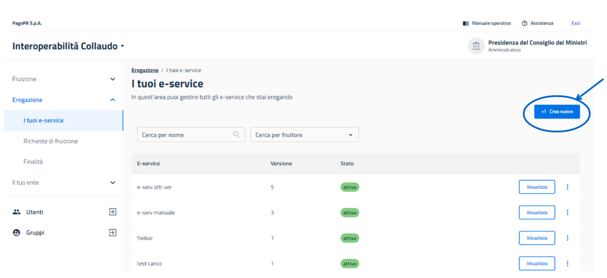
2.  Allo step **Generale** inserisci nome e descrizione come da esempio,
    poi continua con **Salva bozza e prosegui**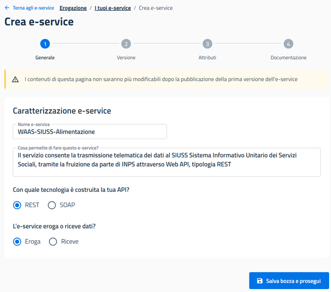

    **Nome dell'e-service**: WAAS-SIUSS-Alimentazione

    **Descrizione**: Il servizio consente la trasmissione
    telematica dei dati al SIUSS Sistema Informativo Unitario dei Servizi
    Sociali, tramite la fruizione da parte di INPS attraverso Web API,
    tipologia REST.
3.  Allo step **Versione** inserisci i dati dei campi obbligatori,
    lasciando come di default (non selezionata) l'attivazione manuale.
    Poi continua con **Salva bozza e prosegui**

    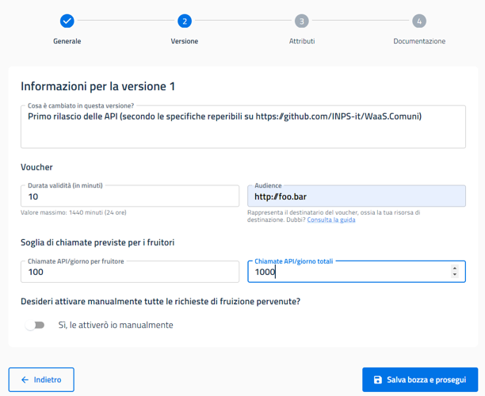

    Suggeriamo i seguenti valori per quanto riguarda la durata del voucher
    e le soglie relative alle chiamate:

    **Durata validità (in minuti):** 1440

    **Chiamate API/giorno per fruitore:** 100

    **Chiamate API/giorno totali:** 100

    **Audience:** SIUSS

4.  Allo step **Attributi** vanno indicati gli attributi che il fruitore
    deve possedere per richiedere la fruizione dell'e-service. In questo
    caso dovrà essere inserito un attributo certificato specifico per il
    fruitore INPS, in quanto solo l'istituto potrà usufruire del
    servizio. Clicca su **Attributi Certificati** \> **Aggiungi
    attributo**

    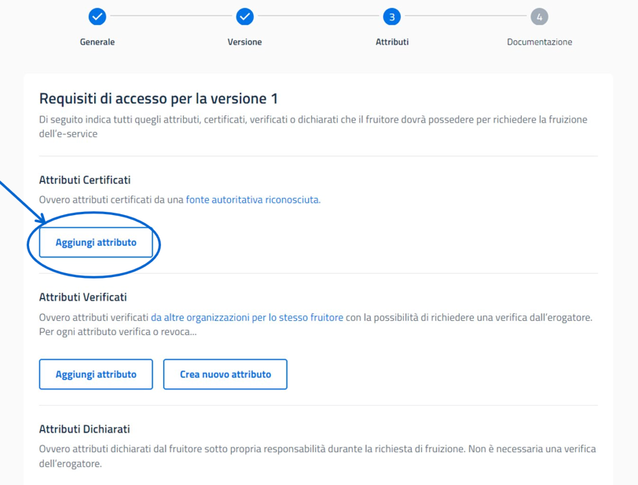

5.  Seleziona **Aggiungi requisito**, digita nel campo di ricerca
    "INPS" e seleziona **Istituto Nazionale Previdenza Sociale -
    INPS**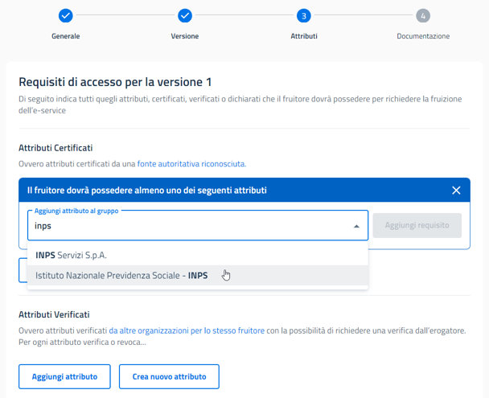

6.  Clicca su **Aggiungi requisito** per confermare la
    selezione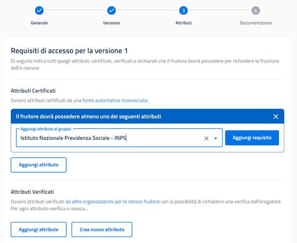

7.  Se l'attributo è stato selezionato correttamente, comparirà tra gli
    attributi certificati, come da esempio seguente. A questo punto
    clicca "**Salva bozza e prosegui**"

    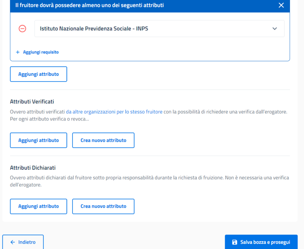

8.  L'ultimo step è dedicato alla **Documentazione** relativa
    all'e-service: qui è necessario caricare il file .yaml con la
    specifica API, scaricato dal repository Github di INPS e
    opportunamente aggiornato [come da punto 3](#3-preparazione-del-file-yaml). Se
    necessario, potrai inserire ulteriore documentazione a supporto

    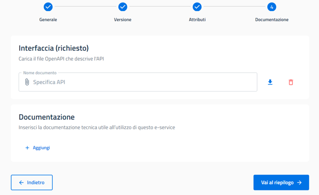

9.  Clicca **Vai al riepilogo** e, dopo aver visualizzato il riepilogo,
    clicca su **Pubblica**

    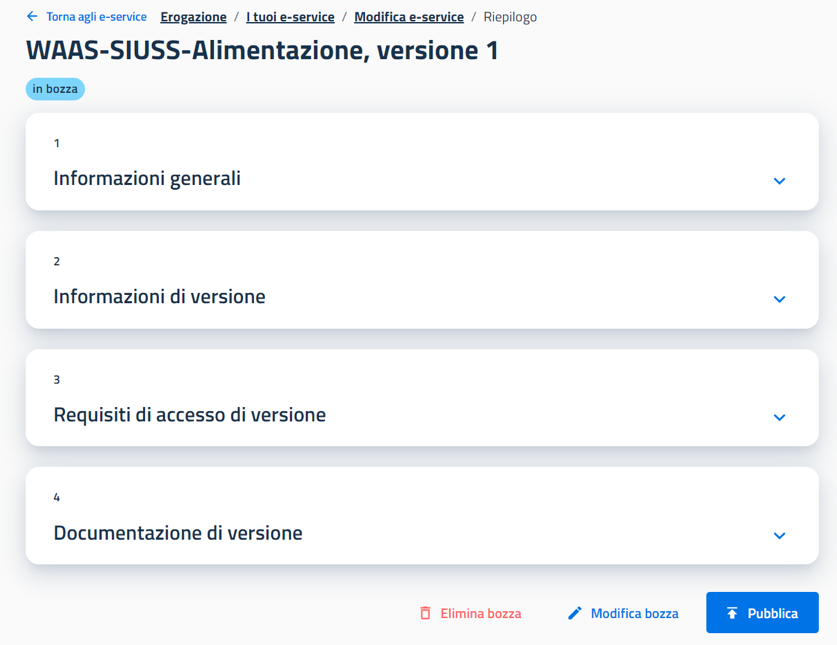

10. **Conferma** la pubblicazione dell'e-service: è completato il
    processo di pubblicazione in piattaforma 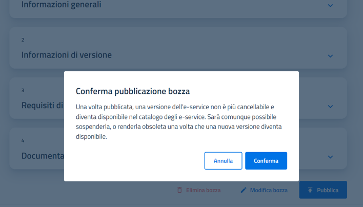

11.  **Invio riferimenti IP ad INPS**
    Completato con successo il processo di pubblicazione dell'e-service in
    piattaforma, INPS richiede di inviare una mail alla casella di posta
    dedicata al progetto ***progettowelfareasaservice@inps.it*** indicando:

  *  il nome dell'Ente;
  * il codice belfiore dell'Ente;
  * IP o range di IP di erogazione del servizio in ambiente di collaudo e produzione;

## LINK UTILI

-   [Manuale PDND](https://docs.pagopa.it/interoperabilita-1)
    Interoperabilità

-   [Repository Github
    WaaS.Comuni](https://github.com/INPS-it/WaaS.Comuni)

